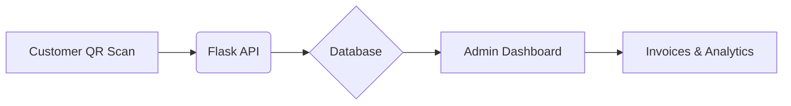

# 🍽️ Smart Restaurant Management System (RMS)


A modern, full-stack **Restaurant Management Solution** designed to bridge the gap between customer convenience and administrative control. This app features a digital QR-menu for customers and a high-performance dashboard for admins.


## 🌟 Key Features

### 👨‍💼 Admin Features (The Command Center)
- **Live Order Stream:** Individual order tracking with real-time status updates.
- **Persistent Analytics:** Daily revenue and profit tracking that survives page reloads.
- **Smart Completion Logic:** When an order is marked as "Completed", it automatically updates the table status and archives the revenue.
- **Table Management:** Visual indicators for "Available" vs "Occupied" tables.

### 📱 Customer Features (Digital Menu)
- **QR-Code Access:** Zero-install menu access via browser.
- **Live Cart:** Add items, view total, and place orders directly to the kitchen.
- **Order Tracking:** Customers can view the progress of their food without calling a waiter.

## 🛠️ Tech Stack

- **Backend:** `Flask` (Python)
- **Database:** `SQLAlchemy` (SQLite)
- **Frontend:** `Bootstrap 5`, `JavaScript` (ES6+), `HTML5`, `CSS3`
- **Architecture:** RESTful API with JSON communication

## 📂 Architecture & Data Flow



## 🚀 Installation & Local Setup

1. **Clone the Project**
```bash
git clone [https://github.com/yourusername/restaurant-mgmt-system.git](https://github.com/yourusername/restaurant-mgmt-system.git)
cd restaurant-mgmt-system

```


2. **Setup Virtual Environment**
```bash
python -m venv venv
# Windows:
venv\Scripts\activate
# Mac/Linux:
source venv/bin/activate

```


3. **Install Dependencies**
```bash
pip install flask flask-sqlalchemy

```


4. **Initialize the Database**
```python
# Run this in a python shell
from app import db, app
with app.app_context():
    db.create_all()

```


5. **Run the Application**
```bash
python app.py

```


*Access the app at `http://127.0.0.1:5000*`

## 📊 API Endpoints

| Method | Endpoint | Description |
| --- | --- | --- |
| `GET` | `/api/admin/orders/live` | Fetches all non-completed orders |
| `POST` | `/api/admin/orders/update/<id>` | Marks an order as Completed/Kitchen |
| `GET` | `/api/analytics` | Returns daily revenue/profit totals |
| `POST` | `/api/admin/tables/clear/<id>` | Manually resets a table session |

## 🛡️ Key Logic: Data Persistence

Unlike basic apps that lose data on refresh, this system calculates analytics based on hard-saved database statuses:

* **Completed Orders** are filtered by a `UTC midnight cutoff` to ensure the dashboard shows today's earnings accurately.
* **Naive Timestamps** are used to ensure cross-platform timezone compatibility between the server and the browser.

## 🤝 Contributing

1. Fork the repo.
2. Create your feature branch (`git checkout -b feature/NewFeature`).
3. Commit your changes (`git commit -m 'Add some NewFeature'`).
4. Push to the branch (`git push origin feature/NewFeature`).
5. Open a Pull Request.

## 📄 License

Distributed under the **MIT License**. See `LICENSE` for more information.

---

**Developed with ❤️ by Your Name/Company**

```

### Tips for your GitHub Repository:
1. **Screenshots:** Take a screenshot of your Admin Dashboard and Customer Menu and put them in a folder named `screenshots/`, then link them in the README.
2. **Tags:** Use tags like `#Flask`, `#Python`, `#SQLAlchemy`, `#RestaurantManagement`, and `#WebDevelopment` when you create the repository settings.
3. **Requirements.txt:** Don't forget to run `pip freeze > requirements.txt` so others can install your dependencies easily.

```
